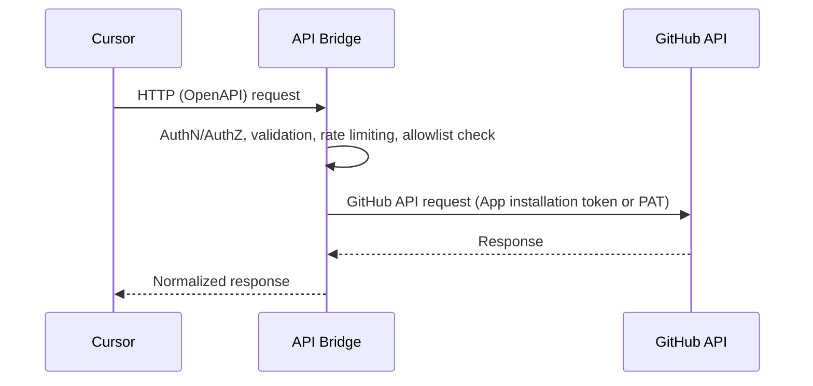

# Architecture

This document describes the high‑level architecture of the GitHub Connector API bridge.

## Overview
- Client: Cursor (private mode) or any HTTP client
- Service: API Bridge (containerized) exposing an OpenAPI contract
- Upstream: GitHub REST API v3 / GraphQL v4

## Technology choices
- Runtime: Python 3.12, FastAPI, Pydantic, httpx
- Contract-first: OpenAPI for request/response validation
- Packaging: Multi-stage Docker (slim), non-root, healthcheck

## Authentication to GitHub
We support two strategies, selectable via environment variables:

- GitHub App (recommended default)
  - Why: Fine-grained permissions, install per repository, auditable, tokens rotate automatically.
  - Flow:
    1) The service creates a short-lived App JWT using `GITHUB_APP_ID` and `GITHUB_APP_PRIVATE_KEY`.
    2) The service exchanges the JWT for an installation access token using `GITHUB_APP_INSTALLATION_ID`.
    3) All GitHub API calls include `Authorization: Bearer <installation_token>`.
  - Required permissions for Issues CRUD and comments (repository-level):
    - Issues: Read and write
    - Metadata: Read-only
  - No webhooks are strictly required for the current scope.

- Personal Access Token (PAT) fallback
  - Why: Simplest for local bootstrap; fewer moving parts.
  - Fine-grained PAT (preferred) permissions: select specific repository access with
    - Issues: Read and write
    - Metadata: Read-only
  - Classic PAT alternative: `repo` scope (coarser; avoid in production).
  - All GitHub API calls include `Authorization: token <GITHUB_TOKEN>`.

Strategy selection
- If `GITHUB_APP_ID` is set, the service uses GitHub App auth.
- Otherwise, it expects `GITHUB_TOKEN` and uses PAT auth.

## Access scope control (allowlist)
- Purpose: Prevent accidental access to repositories outside the user-approved scope.
- Configuration:
  - `ALLOWLIST_REPOS`: Comma-separated list of `owner/repo` entries allowed, e.g. `user1/repoA,orgX/repoZ`.
  - `ALLOWLIST_OWNERS` (optional): Comma-separated list of owners allowed for any repo under them.
- Enforcement:
  - Every endpoint carries `{owner}` and `{repo}` in the path.
  - A request is permitted only if `owner/repo` is in `ALLOWLIST_REPOS`, or `owner` is in `ALLOWLIST_OWNERS`.
  - Requests outside the allowlist return HTTP 403 with a clear error.
- This satisfies the requirement to grant access per individual project/repository.

## Endpoints (initial scope)
- Issues
  - GET `/repos/{owner}/{repo}/issues`
  - GET `/repos/{owner}/{repo}/issues/{issue_number}`
  - POST `/repos/{owner}/{repo}/issues`
  - PATCH `/repos/{owner}/{repo}/issues/{issue_number}` (title/body/state/labels/assignees)
- Comments
  - GET `/repos/{owner}/{repo}/issues/{issue_number}/comments`
  - POST `/repos/{owner}/{repo}/issues/{issue_number}/comments`

Note: GitHub does not delete issues; closing is supported instead of deletion.

## Error handling
- Normalize errors to a consistent envelope: `{ code, message, details, requestId }`.
- Map upstream GitHub errors to meaningful HTTP status codes.

## Rate limiting & retries
- Respect GitHub `X-RateLimit-*` headers.
- Retries: Exponential backoff with decorrelated jitter.
- When exhausted, return 429 and include `Retry-After` when available.

## Observability (later)
- Deferred for now (pet project). Future: JSON logs, request IDs, basic `/metrics`.

## Docker packaging
- Multi-stage build using `python:3.12-slim` base.
- Non-root user, minimal OS packages, healthcheck.
- Configuration via environment variables only.

## Configuration (environment variables)
- GitHub App (recommended):
  - `GITHUB_APP_ID`
  - `GITHUB_APP_INSTALLATION_ID`
  - `GITHUB_APP_PRIVATE_KEY` (PEM content or base64-encoded; exact format will be documented)
- PAT fallback:
  - `GITHUB_TOKEN`
- Scope control:
  - `ALLOWLIST_REPOS` (comma-separated)
  - `ALLOWLIST_OWNERS` (comma-separated, optional)
- Server:
  - `PORT` (default 8080)
