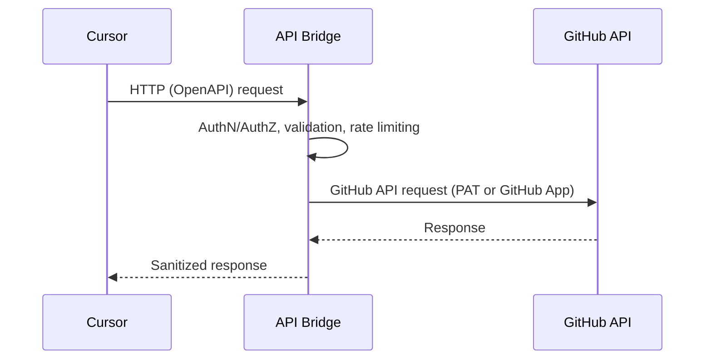

# Architecture

This document describes the high‑level architecture of the GitHub Connector API bridge.

## Overview
- Client: Cursor (private mode) or any HTTP client
- Service: API Bridge (containerized) exposing an OpenAPI contract
- Upstream: GitHub REST API v3 / GraphQL v4

## Components
- API Layer: OpenAPI-first implementation (e.g., FastAPI/Express). Validates requests and responses.
- Auth: Prefer GitHub App with fine-grained permissions; support PAT as fallback via env vars.
- GitHub Client: Thin wrapper around GitHub REST for issues and comments.
- Observability: Structured logging, request IDs, basic metrics.
- Packaging: Docker image; env-configured.

## Endpoints (initial scope)
- Issues
  - GET `/repos/{owner}/{repo}/issues`
  - GET `/repos/{owner}/{repo}/issues/{issue_number}`
  - POST `/repos/{owner}/{repo}/issues`
  - PATCH `/repos/{owner}/{repo}/issues/{issue_number}` (e.g., title/body/state/labels/assignees)
- Comments
  - GET `/repos/{owner}/{repo}/issues/{issue_number}/comments`
  - POST `/repos/{owner}/{repo}/issues/{issue_number}/comments`

Note: GitHub does not delete issues; closing is supported instead of deletion.

## Security
- Credentials via environment variables (GitHub App or PAT) injected at runtime.
- Do not log secrets; redact sensitive headers.
- Optional allowlist of repositories/owners to restrict access.

## Deployment
- Local: `docker run` with required env vars
- CI/CD: Build and publish image; sign image; attach SBOM
- Future: Helm chart or ECS task definition
